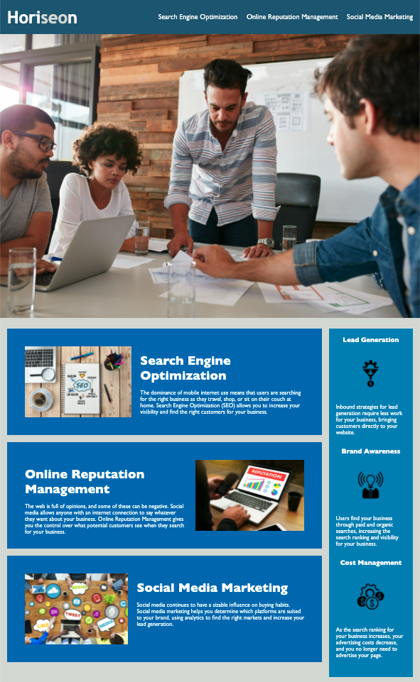

# Horiseon website

## Description

This website has the intention to inform about the importance of being aware of the impact that social media and new technologies have in the way to do businees in the internet.

Horiseon website has been created in html language using the following tags:

* head
* header
* Figure
* Body
* Main
* Section
* Footer

Tags above were modifed by CSS giving them a better style and presentation to the users, applying the following properties:

* flexbox
* inline-block
* margins
* font-size
* font-family
* padding
* etc..
  
## Website Presentation

The image below show how the website it´s diplayed.

## Link to deployed application

https://jorgecdl96.github.io/HoriseonJHCL/